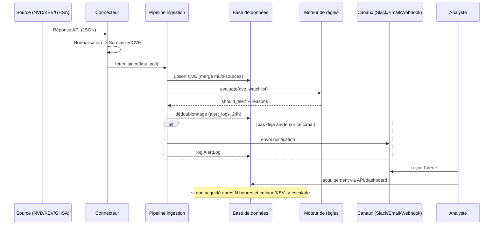

# Architecture VulnAegis

## 1. Architecture livrée (MVP)

Le MVP privilégie une stack **simple à opérer et peu coûteuse**, capable de tenir
la charge d'un SOC unique (des dizaines de milliers de CVE, quelques centaines
d'assets en watchlist), avant d'investir dans Kafka/Elasticsearch/Kubernetes
(voir §3).

```mermaid
flowchart LR
    subgraph Sources
        NVD[NVD API 2.0]
        KEV[CISA KEV JSON]
        GHSA[GitHub Advisories API]
        OSV[OSV.dev - enrichissement à la demande]
        GHPOC[GitHub Search API\nradar PoC temps réel]
        EPSS[EPSS CSV quotidien\nFIRST.org]
    end

    subgraph VulnAegis["VulnAegis (1 conteneur FastAPI)"]
        SCHED[APScheduler\npoll principal 5 min]
        SCHEDFAST[APScheduler\nradar PoC ~4 min, découplé]
        CONN[Connecteurs\n(1 classe par source)]
        INGEST[Pipeline d'ingestion\nupsert + dédup + validation cve_id]
        RULES[Moteur de règles\nCVSS / KEV / PoC / exploitation imminente / watchlist]
        API[API REST FastAPI]
        DASH[Dashboard statique\nHTML/JS + page Radar PoC]
    end

    DB[(PostgreSQL / SQLite\n+ table PocLink)]

    NVD --> CONN
    KEV --> CONN
    GHSA --> CONN
    OSV -.enrichissement.-> INGEST
    EPSS -.enrichissement quotidien.-> INGEST
    GHPOC -->|découvertes de PoC| SCHEDFAST

    SCHED --> CONN --> INGEST --> DB
    SCHEDFAST --> INGEST
    INGEST --> RULES
    RULES -->|Slack| SLACK[Slack Webhook]
    RULES -->|Email| SMTP[SMTP]
    RULES -->|Webhook| SIEM[TheHive / Splunk / QRadar]

    API --> DB
    DASH --> API
    Analyste((Utilisateur)) --> DASH
    Analyste --> API
```

### Composants et rôle

| Composant | Rôle | Pourquoi ce choix pour le MVP |
|---|---|---|
| **FastAPI** | API REST + hébergement du dashboard statique | Async natif, doc OpenAPI auto-générée (`/docs`), écosystème Python cohérent avec le scraping/parsing |
| **APScheduler** | Polling périodique in-process, plusieurs jobs à cadences différentes (poll principal, radar PoC, EPSS quotidien, escalade) | Zéro infra supplémentaire (pas de Celery/broker) ; le radar PoC tourne sur son propre job pour rester "temps réel" même si le poll principal (NVD notamment) est lent - remplaçable par Celery Beat sans changer le code métier |
| **SQLAlchemy + PostgreSQL (SQLite en dev)** | Stockage CVE, `PocLink` (découvertes de PoC), watchlist, logs d'alerte | Un modèle relationnel simple suffit tant que la recherche full-text n'est pas critique ; migration Postgres→ES découplée par design (`app/models.py` reste la source de vérité) |
| **Migration additive (`app/database.py::_add_missing_columns`)** | Ajoute les colonnes manquantes sur une base déjà peuplée | Pas d'Alembic dans ce projet - un `ALTER TABLE ADD COLUMN` + backfill des valeurs par défaut suffit tant que le schéma n'a besoin que d'évoluer de façon additive |
| **Connecteurs (`app/connectors/`)** | Un module par source, interface `BaseConnector.fetch_since()` | Ajouter une source = ajouter une classe + l'enregistrer dans `CONNECTOR_REGISTRY`, sans toucher au pipeline |
| **Radar PoC (`app/connectors/github_poc.py`)** | Découverte de PoC (pas de métadonnées CVE) sur son propre job planifié | Répond à une question différente ("un repo vient-il d'apparaître ?") que les connecteurs classiques - cadence courte et indépendante du poll principal |
| **Moteur de règles (`app/alerting/rules.py`)** | Décide alerte oui/non + raisons | Centralise CVSS ≥ seuil, présence KEV, PoC (+ raison distincte de risque d'exploitation imminente si PoC sur CVE déjà critique/KEV), watchlist - testé unitairement, indépendant des canaux de notif |
| **Dashboard statique** | Vue temps réel pour l'utilisateur, dont une page "Radar PoC" dédiée | HTML/CSS/JS vanilla servis par FastAPI : pas de build Node, pas de dépendance CDN (fonctionne en environnement air-gapped/on-premise) |

### Pourquoi ne pas partir directement sur Kafka/Elasticsearch/K8s ?

Pour un seul SOC avec un volume de CVE de l'ordre de quelques dizaines de
milliers d'entrées et un polling de l'ordre de la minute, cette stack
apporterait une complexité opérationnelle (cluster à maintenir, capacity
planning, coûts) sans bénéfice mesurable. Le code est structuré pour que la
bascule soit un changement d'infrastructure, pas une réécriture :
- Les connecteurs ne connaissent pas la base de données (ils retournent des
  `NormalizedCVE` Pydantic) → on peut les brancher demain sur un producer Kafka.
- Le moteur de règles ne connaît pas les canaux de notification → on peut le
  rebrancher sur un consumer Kafka qui déclenche des règles en streaming.
- Les modèles SQLAlchemy sont indépendants du moteur (Postgres aujourd'hui,
  réplication vers Elasticsearch demain via un job d'indexation).

## 2. Architecture cible à grande échelle (roadmap, voir `SCALING.md`)

```mermaid
flowchart TB
    subgraph Ingestion
        C1[Connecteurs sources] --> MQ[Kafka: topic cve.raw]
    end

    MQ --> NORM[Workers de normalisation\n(Celery/K8s Jobs, scaling horizontal)]
    NORM --> MQ2[Kafka: topic cve.normalized]

    MQ2 --> IDX[Indexeur Elasticsearch]
    MQ2 --> TSDB[TimescaleDB\nhistorique/analytics]
    MQ2 --> RULESENGINE[Moteur de règles streaming\n(Kafka Streams / worker Python)]

    RULESENGINE --> NOTIF[Service de notification\n(Slack/Email/Webhook)]
    RULESENGINE -.dédoublonnage.-> REDIS[(Redis)]

    IDX --> API2[API REST/GraphQL\n(plusieurs replicas K8s)]
    TSDB --> API2
    API2 --> LB[Load Balancer\nNginx/HAProxy]
    LB --> WEB[Frontend React/Next.js\nWebSocket temps réel]

    API2 -.cache.-> REDIS
```

Différences clés par rapport au MVP :
- **Kafka** découple l'ingestion (rate-limitée par des APIs externes) du
  traitement (normalisation, règles), et permet de rejouer un flux en cas de
  bug dans le moteur de règles.
- **Elasticsearch** prend en charge la recherche full-text/facettée à grande
  échelle (le `ilike` PostgreSQL du MVP ne scale pas au-delà de quelques
  centaines de milliers de lignes avec de la recherche libre).
- **Redis** sert de cache de requêtes API et de store de dédoublonnage
  distribué (le MVP fait ce dédoublonnage via une requête SQL sur
  `alert_logs`, suffisant tant qu'il n'y a qu'une seule instance).
- **WebSockets** remplacent le polling 30s du dashboard MVP pour du push
  temps réel.

## 3. Flux de données (séquence d'une alerte)


